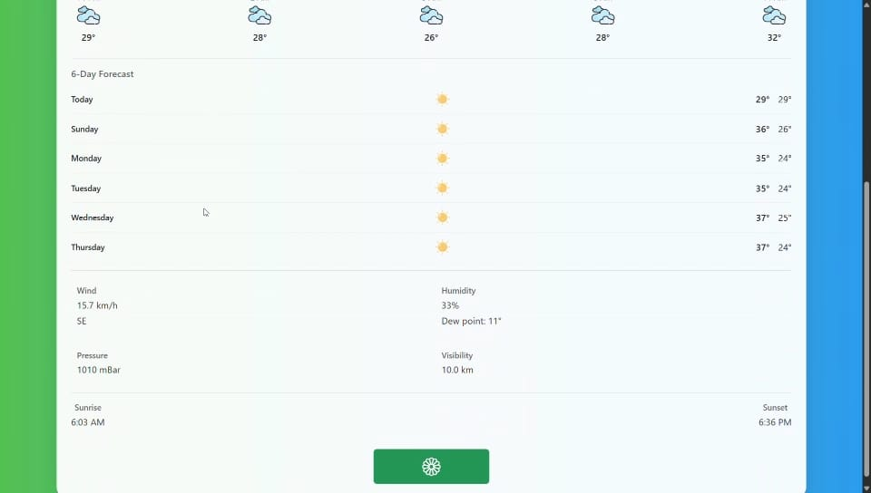

# 🌾 Smart Weather & Crop Monitoring System for Farmers

A real-time web-based dashboard that provides weather forecasting and live crop condition monitoring for farmers using OpenWeatherMap API and Arduino Cloud. Farmers can view temperature, humidity, soil moisture, and make data-driven decisions for better crop management.

This project is a powerful web-based dashboard that helps farmers make informed decisions by combining **real-time weather forecasting** with **live crop condition monitoring** using **Arduino IoT Cloud** and the **OpenWeatherMap API**.

---

## 🔧 Features

### 🌤️ Weather Forecast System
- Get **current weather** of any city using OpenWeatherMap API
- View **6-day weather forecast** with temperature highs/lows
- **Hourly weather** data (3-hour intervals)
- Displays humidity, dew point, pressure, wind, sunrise/sunset
- Custom weather icons and smooth UI/UX

### 🌱 Crop Monitoring Dashboard
- Embedded **Arduino Cloud dashboard** to show:
  - 🌡️ Temperature
  - 💧 Humidity
  - 🌾 Soil Moisture (if integrated)
- Monitors live crop conditions using ESP32 or Arduino-compatible IoT devices
- Real-time decision-making for irrigation & farming activities

---

## 🖼️ Screenshots

| Weather Dashboard | Arduino Crop Monitor |
|-------------------|----------------------|
|  |  |
|  |  |

🎬 **[Screen Recording Available](assets/Screen%20Recording%202025-04-26%20230627.mp4)**

> 📸 Screenshots and demo recordings are stored inside the `assets/` folder.

---

## 🚀 How to Run Locally

### 1. Clone the repository
```bash
git clone https://github.com/Anmol0240/Smart-Weather-Crop-Monitoring-System-for-Farmer.git
cd Smart-Weather-Crop-Monitoring-System-for-Farmer
```

### 2. Open in browser
Just open `index.html` in any browser to start using the weather dashboard.

---

## 🌐 Live Demo

> 🔗 *Coming soon!*  
(*You can deploy it using GitHub Pages or Netlify and paste the link here.*)

---

## 🧠 Tech Stack

- **HTML, CSS, JavaScript, jQuery**
- **OpenWeatherMap API** (for weather data)
- **Arduino IoT Cloud** (real-time sensor dashboard)
- **Bootstrap 5** (styling)
- **Moment.js** (date/time formatting)

---

## 📡 ESP32 Integration (Optional)

If you're using ESP32 to send sensor data:
- Update `script1.js` with your ESP32's local IP address:
```js
const ESP32_IP = 'http://192.168.X.X/data';
```

---

## 📁 Project Structure

```
📦 root/
 ┣ 📄 index.html              → Weather dashboard
 ┣ 📄 index1.html             → Arduino monitoring page
 ┣ 📄 script.js               → Weather data script
 ┣ 📄 script1.js              → ESP32 data fetch script (optional)
 ┣ 📄 style.css               → Styles for weather app
 ┣ 📄 styles1.css             → Styles for dashboard
 ┣ 📁 icons/                  → Weather icons
 ┣ 📁 assets/                 → Screenshots and recordings
     ┣ weather-1.jpg
     ┣ weather-2.jpg
     ┣ dashboard-1.jpg
     ┣ dashboard-2.jpg
     ┗ Screen Recording 2025-04-26 230627.mp4
```

---

## 🙌 Author

👤 **Anmol H**  
📧 anmol.bhonsale6@gmail.com  
🔗 [LinkedIn](https://www.linkedin.com/in/anmol-h-5148332a1)

---

## 📄 License

This project is open-source and available under the **MIT License**.  
See the [LICENSE](LICENSE) file for details.

---
